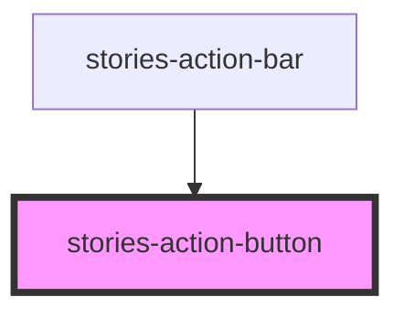

# stories-actionbutton

<!-- Auto Generated Below -->

## Properties

| Property     | Attribute | Description         | Type                                                                                   | Default     |
| ------------ | --------- | ------------------- | -------------------------------------------------------------------------------------- | ----------- |
| `actionItem` | --        | ActionItem property | `{ command: string; title: string \| Element; disabled?: boolean; active?: boolean; }` | `undefined` |

## Events

| Event    | Description  | Type                       |
| -------- | ------------ | -------------------------- |
| `action` | Action Event | `CustomEvent<ActionEvent>` |

## Dependencies

### Used by

 - [stories-action-bar](../action-bar)

### Graph

----------------------------------------------

*Built with [StencilJS](https://stenciljs.com/)*
