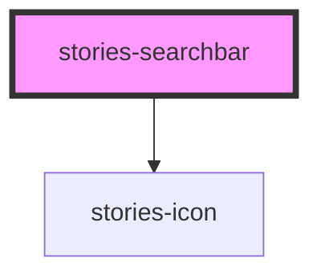

# stories-searchbar

<!-- Auto Generated Below -->

## Properties

| Property           | Attribute            | Description                                                                                                                                                                                                                                                                                                          | Type                                                                                  | Default              |
| ------------------ | -------------------- | -------------------------------------------------------------------------------------------------------------------------------------------------------------------------------------------------------------------------------------------------------------------------------------------------------------------- | ------------------------------------------------------------------------------------- | -------------------- |
| `cancelButtonIcon` | `cancel-button-icon` | Set the cancel button icon. Only applies to `md` mode. Defaults to `"arrow-back-sharp"`.                                                                                                                                                                                                                             | `string`                                                                              | `'arrow-back-sharp'` |
| `clearIcon`        | `clear-icon`         | Set the clear icon. Defaults to `"close-circle"` for `ios` and `"close-sharp"` for `md`.                                                                                                                                                                                                                             | `string`                                                                              | `undefined`          |
| `color`            | `color`              | The color to use from your application's color palette. Default options are: `"primary"`, `"secondary"`, `"tertiary"`, `"success"`, `"warning"`, `"danger"`, `"light"`, `"medium"`, and `"dark"`. For more information on colors, see [theming](/docs/theming/basics).                                               | `string`                                                                              | `undefined`          |
| `debounce`         | `debounce`           | Set the amount of time, in milliseconds, to wait to trigger the `ionChange` event after each keystroke. This also impacts form bindings such as `ngModel` or `v-model`.                                                                                                                                              | `number`                                                                              | `250`                |
| `disabled`         | `disabled`           | If `true`, the user cannot interact with the input.                                                                                                                                                                                                                                                                  | `boolean`                                                                             | `false`              |
| `inputmode`        | `inputmode`          | A hint to the browser for which keyboard to display. Possible values: `"none"`, `"text"`, `"tel"`, `"url"`, `"email"`, `"numeric"`, `"decimal"`, and `"search"`.                                                                                                                                                     | `"decimal" \| "email" \| "none" \| "numeric" \| "search" \| "tel" \| "text" \| "url"` | `undefined`          |
| `placeholder`      | `placeholder`        | Set the input's placeholder. `placeholder` can accept either plaintext or HTML as a string. To display characters normally reserved for HTML, they must be escaped. For example `<Ionic>` would become `&lt;Ionic&gt;`  For more information: [Security Documentation](https://ionicframework.com/docs/faq/security) | `string`                                                                              | `'Search'`           |
| `searchIcon`       | `search-icon`        | The icon to use as the search icon. Defaults to `"search-outline"` in `ios` mode and `"search-sharp"` in `md` mode.                                                                                                                                                                                                  | `string`                                                                              | `undefined`          |
| `showCancelButton` | `show-cancel-button` | Sets the behavior for the cancel button. Defaults to `"never"`. Setting to `"focus"` shows the cancel button on focus. Setting to `"never"` hides the cancel button. Setting to `"always"` shows the cancel button regardless of focus state.                                                                        | `"always" \| "focus" \| "never"`                                                      | `'never'`            |
| `showClearButton`  | `show-clear-button`  | Sets the behavior for the clear button. Defaults to `"focus"`. Setting to `"focus"` shows the clear button on focus if the input is not empty. Setting to `"never"` hides the clear button. Setting to `"always"` shows the clear button regardless of focus state, but only if the input is not empty.              | `"always" \| "focus" \| "never"`                                                      | `'always'`           |
| `type`             | `type`               | Set the type of the input.                                                                                                                                                                                                                                                                                           | `"email" \| "number" \| "password" \| "search" \| "tel" \| "text" \| "url"`           | `'search'`           |
| `value`            | `value`              | the value of the searchbar.                                                                                                                                                                                                                                                                                          | `string`                                                                              | `''`                 |

## Events

| Event           | Description                                     | Type                                      |
| --------------- | ----------------------------------------------- | ----------------------------------------- |
| `storiesBlur`   | Emitted when the input loses focus.             | `CustomEvent<void>`                       |
| `storiesCancel` | Emitted when the cancel button is clicked.      | `CustomEvent<void>`                       |
| `storiesChange` | Emitted when the value has changed.             | `CustomEvent<SearchbarChangeEventDetail>` |
| `storiesClear`  | Emitted when the clear input button is clicked. | `CustomEvent<void>`                       |
| `storiesFocus`  | Emitted when the input has focus.               | `CustomEvent<void>`                       |
| `storiesInput`  | Emitted when a keyboard input occurred.         | `CustomEvent<KeyboardEvent>`              |

## Methods

### `getInputElement() => Promise<HTMLInputElement>`

Returns the native `<input>` element used under the hood.

#### Returns

Type: `Promise<HTMLInputElement>`

### `setFocus() => Promise<void>`

Sets focus on the specified `ion-searchbar`. Use this method instead of the global
`input.focus()`.

#### Returns

Type: `Promise<void>`

## Dependencies

### Depends on

- [stories-icon](../icon)

### Graph

----------------------------------------------

*Built with [StencilJS](https://stenciljs.com/)*
