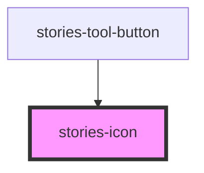

# stories-icon

<!-- Auto Generated Below -->

## Properties

| Property | Attribute | Description | Type     | Default     |
| -------- | --------- | ----------- | -------- | ----------- |
| `name`   | `name`    | Icon name   | `string` | `undefined` |

## Dependencies

### Used by

 - [stories-tool-button](../stories-tool-button)

### Graph

----------------------------------------------

*Built with [StencilJS](https://stenciljs.com/)*
