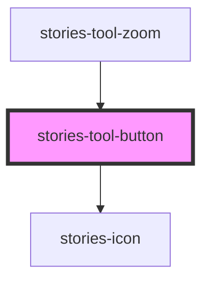

# stories-toolbutton

<!-- Auto Generated Below -->

## Properties

| Property   | Attribute  | Description       | Type                                   | Default     |
| ---------- | ---------- | ----------------- | -------------------------------------- | ----------- |
| `command`  | `command`  | command property  | `"zoomIn" \| "zoomOut" \| "zoomReset"` | `undefined` |
| `disabled` | `disabled` | disabled property | `boolean`                              | `undefined` |
| `icon`     | `icon`     | icon property     | `string`                               | `undefined` |

## Events

| Event           | Description  | Type                                                |
| --------------- | ------------ | --------------------------------------------------- |
| `storiesAction` | Action Event | `CustomEvent<{ command: string; data?: unknown; }>` |

## Dependencies

### Used by

 - [stories-tool-zoom](../tool-zoom)

### Depends on

- [stories-icon](../icon)

### Graph

----------------------------------------------

Built with ❤ at StoriesJS
