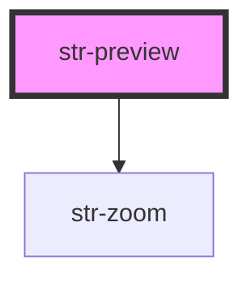

# Preview

The Preview (str-preview) is a wrapper container for [str-renderer](../renderer) component. It utilises [str-zoom](../zoom) component to manage visual size of the rendering content. 

<!-- Auto Generated Below -->

## Dependencies

### Depends on

- [str-zoom](../zoom)

### Graph

----------------------------------------------

Built with [StencilJS](https://stenciljs.com/) at StoriesJS
