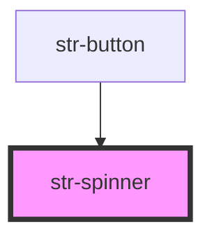

# Spinner

The Spinner (str-spinner) displays a continuous loader on the user interface.

<!-- Auto Generated Below -->

## CSS Custom Properties

| Name                | Description                           |
| ------------------- | ------------------------------------- |
| `--indicator-color` | The color of the spinner's indicator. |
| `--stroke-width`    | The width of the indicator.           |
| `--track-color`     | The color of the spinner's track.     |

## Dependencies

### Used by

 - [str-button](../button)

### Graph

----------------------------------------------

Built with [StencilJS](https://stenciljs.com/) at StoriesJS
