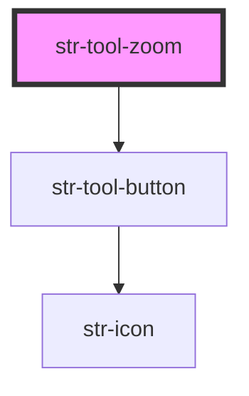

# str-tool-zoom

The str-tool-zoom is a container for zoom-in, zoom-out, and zoom-reset buttons.

<!-- Auto Generated Below -->

## Dependencies

### Depends on

- [str-tool-button](../tool-button)

### Graph

----------------------------------------------

Built with [StencilJS](https://stenciljs.com/) at StoriesJS
