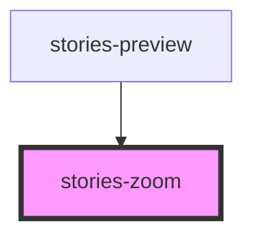

# stories-zoom

The stories-zoom is a container managing visual zoom of content.

<!-- Auto Generated Below -->

## Properties

| Property | Attribute | Description | Type     | Default |
| -------- | --------- | ----------- | -------- | ------- |
| `zoom`   | `zoom`    |             | `number` | `1`     |

## Dependencies

### Used by

 - [stories-preview](../preview)

### Graph

----------------------------------------------

Built with ❤ at StoriesJS
